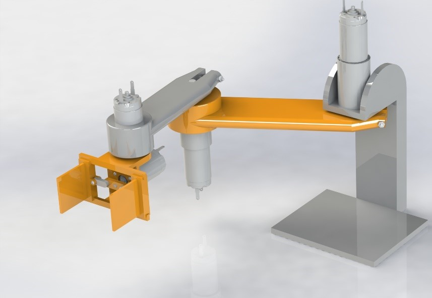
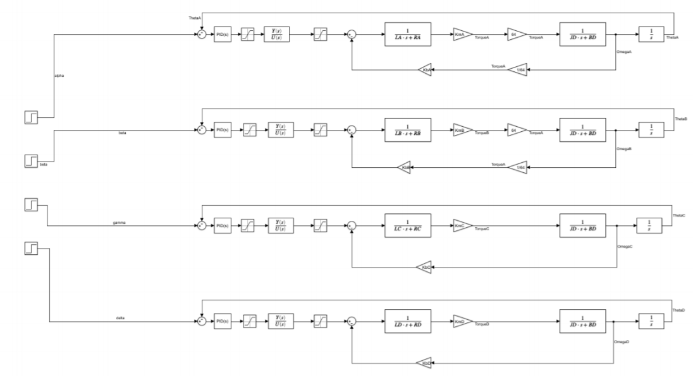
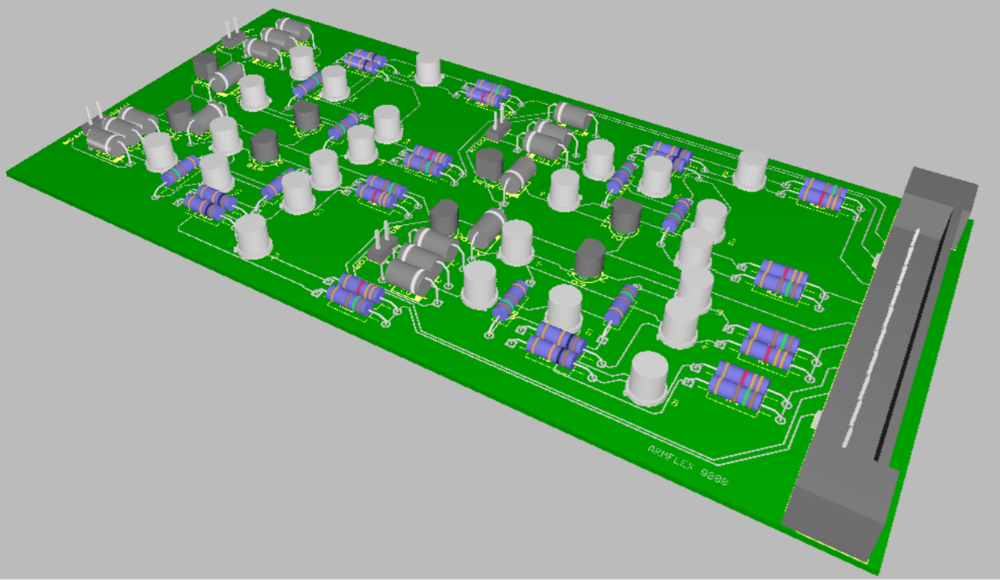

University of British Columbia  
ELEC 391

#### ARMFLEX9000
- Sajjad Al-Kazzaz
- Michael Aono
- Daniel Nadeem

# Quality Control Robot

[Project RCG outline](e391Proj2021.pdf)

## Project Details

## Mechanics

The physical model of a series robot arm with an attached gripping mechanism is designed and developed 
to perform quality control on marshmallows. The model is then used to find a linear approximation for 
an operating point, which is in turn used to run a simulation of the quality control procedure.

## Control

ARMFLEX9000 is a 3.5 DOF arm that was developed for the purposes of quality
control of marshmallows on a conveyor-belt. This paper will discuss some aspects
of the design of the robot, as well as control of the robot.

In this paper, Section 1 describes the robotics, including kinematics and path
planning. Section 2 discusses robot modelling in Matlab and SimulationX.
Section 3 describes the Matlab controller, this includes system control and PID
implementation. Section 4 goes over PID tuning. Section 5 describes porting
the controller to C. Finally, Section 6 will discuss system performance.

## Electrical

A driver system is developed to power the motors of the quality control robot. The quality control robot
is capable of three and a half DOF and is powered by 4 identical OTS graphite communicated motors.
The torque requirements of the robot are met with the addition of planetary gear heads of reduction
ratio 64:1 on the base arms. The driver system is of H-bridge form and outputs 11.2V to the motors from
5V input. A PCD design is of the driver is developed to create a mother-daughter board with the Ardinuo
Leonardo.

